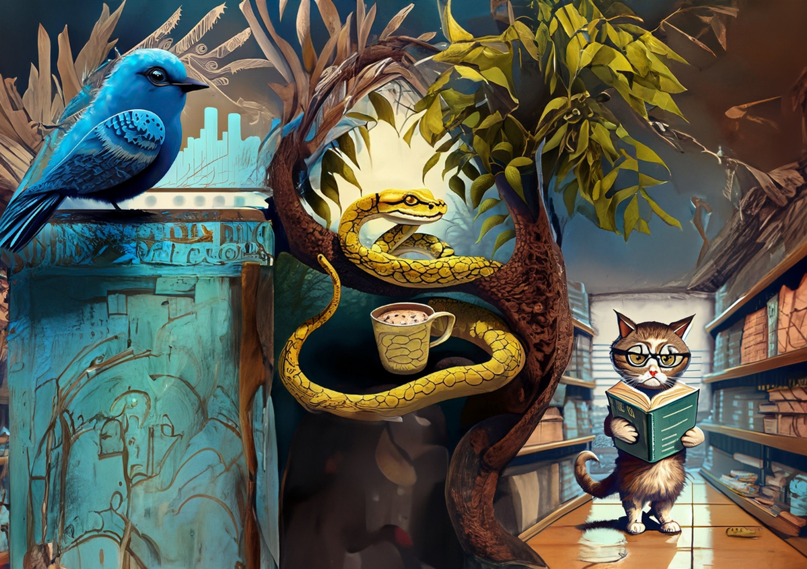

<h1 align="center">AI Code Challenges</h1>

Welcome to the index of the AI Code Challenges repository! The main goal of this project is to offer automated solutions for the challenges listed in the "code_challenge.csv" file. Leveraging the capabilities of ChatGPT, an advanced AI language model, it provides solutions in five different code languages.

**The link to the final wiki containing the documentation can be found [here](https://ai-code-challenge.tiddlyhost.com/).**

## Table of Contents

1. Analyzing the Code Challenges
2. Automated Solutions for the Challenges
3. Documentation for the Code Challenges using TiddlyWiki

## Analyzing the Code Challenges

In this section, we thoroughly analyze the Code challenges presented in the "code_challenge.csv" file.

## Automated Solutions for the Challenges

Here, you'll find a Jupyter Notebook containing the automated solutions generated by ChatGPT for each of the listed challenges.

## Documentation for the Code Challenges using TiddlyWiki

This notebook aims to convert Python code into comprehensive TiddlyWiki-based documentation.

### Notebooks:

1. [Analyzing the Code Challenges](analyzing-the-code-challenges.ipynb)
2. [Automated Solutions for the Challenges](automated-solutions-for-the-challenges.ipynb)
3. [Documentation for the Code Challenges using TiddlyWiki](documentation-for-the-code-challenges.ipynb)

Feel free to explore each notebook to understand the challenges and their corresponding automated solutions.

I hope you find these automated solutions helpful and educational. Happy coding! 🚀

